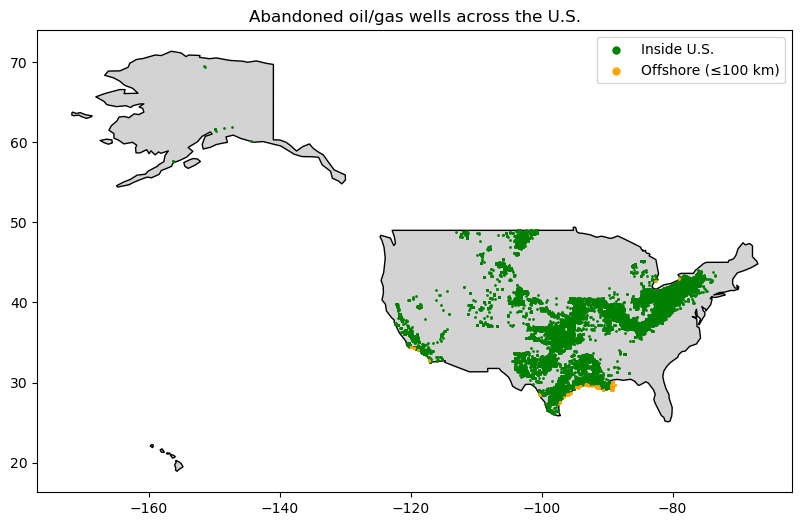
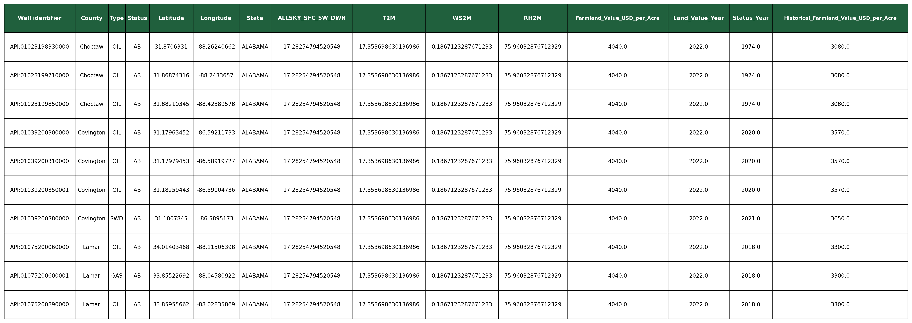
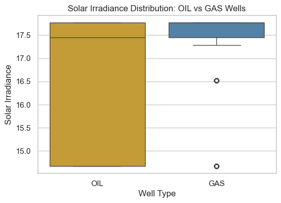
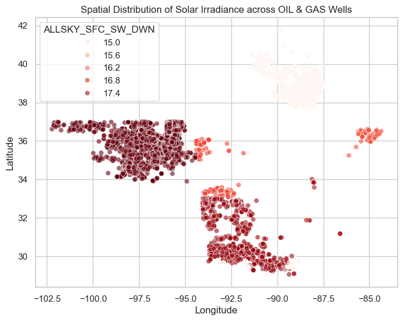
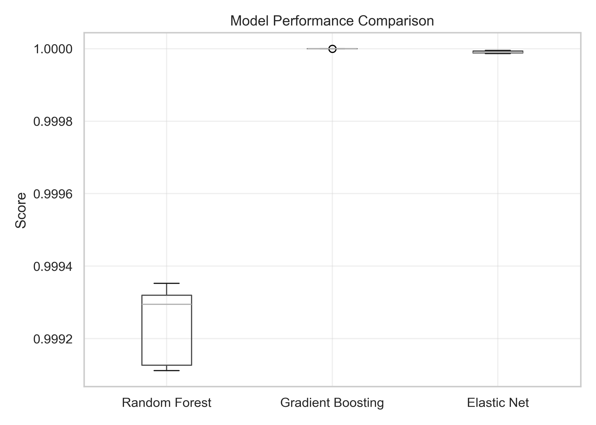

Abandoned and orphaned oil and gas wells across the United States (evident in Figure 1.) pose ongoing environmental and economic risks, including emissions of volatile organic compounds (VOCs), groundwater contamination, and methane leaks. Across the U.S., numerous oil and gas companies have optimized their contractual agreement with their respective property lenders, mainly commercial banks and private equity, and, in return, left the property with overall diminished value. So, for these property lenders, the ultimate question becomes, how can the land restore its value, either agriculturally or by clean energy, once the contractual agreement is met and the oil or gas company decommissions their infrastructure? This specific project aims to explore how predictive models use spatial, environmental, and economic datasets to estimate post-restoration land value (in dollars per acre) for abandoned gas well sites. Addressing this challenge requires scalable, data-driven strategies for prioritizing land evaluation. 

Figure 1: Distribution of abandoned oil and gas wells nationwide.

A combination of USGS, NASA POWER and USDA Land Survey Data were utilized to create an optimized dataset for this case study. By combining these reputable data sources, quantifiable details of renewable energy potential and land value economics harmoniously merge to create an intricate picture of how environmental variables impact property value. 

Figure 2:  Head of the dataset. 

To avoid misinterpreting the relationship between post-restoration land value and environmental variables, only the spatially consistent data was utilized for the model. This trimming process solely used the paramount independent variable, solar irradiance, as the parameter. Evident in Figure 3., handling spatially consistent solar irradiance data (“ALLSKY_SFC_SW_DWN”) reduces uncertainty in modeling and forecasting solar output. Therefore, this project focuses on gas wells in the West South Central U.S. region (Figure 4.), where such data exhibit strong regional uniformity.

There is a significant tradeoff to concentrating the data, as selection bias and suppressed heterogeneity amongst environmental covariables increase concern in generalizability. However, the return of lower noise and ‘proof-of-concept’ was more important for the sake of this analysis. It is encouraged to view the more detailed explanation within the code file. 

Figure 3: Solar irradiance consistency for gas wells. 

Figure 4: Concentration of analyzed wells in the West South Central region. 

Becasuse the data displays potential multicollinearity (between historic and current land value) and the climate variables are continuous in nature, a Random Forest Regression model was applied as the primary predictive model for this study. To vet the primary model’s results, a comparison analysis was conducted across multiple other models, detailed within the project, to corrobotate if the primary results reflect real signal. Additionally, bias is reduced by cross-validating (5-fold) each model.  

Results, displayed in Figure 5., indicate that both environmental variables and historical farmland value provide significant predictive signal, with spatial features materially enhancing model performance. Nearly all variance in farmland value is explained by the feature set. 

Figure 5: Comparing model results. 

Limitations include lack of temporal validation, as this would strengthen conclusions about forecasting ability. Training models on earlier years of data and testing on later periods would better assess how well relationships generalize over time, particularly for economic variables like farmland value that evolve slowly but nonlinearly. Also, because farmland value and environmental variables exhibit spatial autocorrelation, the coordinate data could be spatially cross-validated to avoid geographically induced overfitting. 

